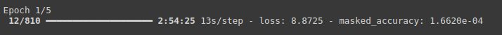
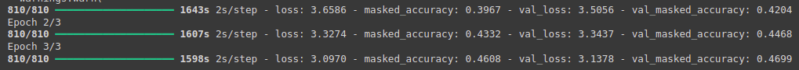
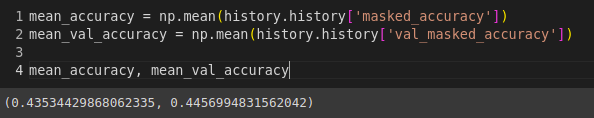

# Changes

- The original notebook takes about 3 hours to run 1 epoch, and it trains for 20 epochs, so the total training would take too long to complete.

- To overcome that, the number of epochs was changed to 3 epochs, and the following hyperparameters were changed:
  - `num_layers` (from 4 to 3): Reducing the number of layers decreases model complexity, leading to fewer parameters to train and faster forward/backward passes.
  - `d_model` (from 128 to 32): A smaller model dimension reduces the size of the internal representations, requiring fewer computational resources and less memory.
  - `dff` (from 512 to 128): Reducing the number of neurons in the layers lowers the number of operations, possibly speeding up training.
  - `num_heads` (from 8 to 4): Fewer heads simplify the attention mechanism, possibly reducing the amount of parallel computation.
  - `dropout_rate` (from 0.1 to 0.2): A higher dropout rate regularizes the model more, possibly improving training speed by focusing more on essential patterns.

- These modifications improved the training speed to be concluded in approximately 82 minutes.

The final accuracy obtained was 44%:

# Personal insights

- Positive points:
	- Notebook has great descriptions. They were very helpful to understand what was happening in the code and implement a change in the model.
  - The notebook is well structured.

- Negative points:
	- Model training takes way too long (more than 3 hours), so I had to decrease the number of epochs in training.
	- The notebook is too long.
